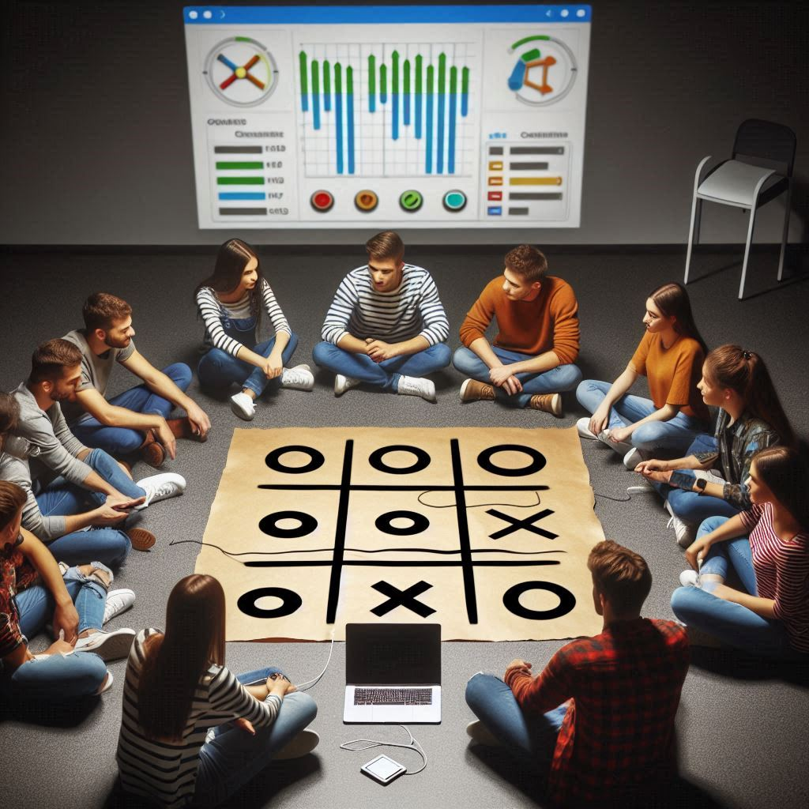
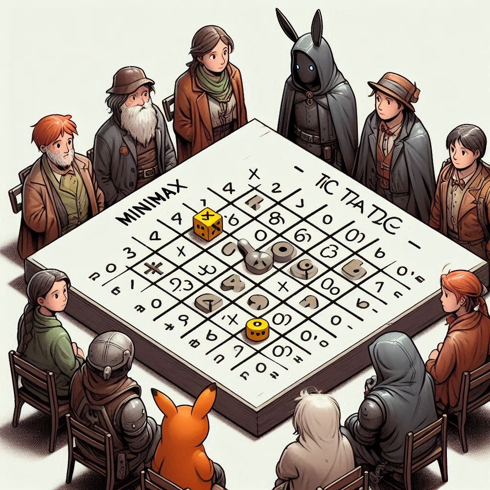

# AI-Powered React Tic Tac Toe with Socket.IO


Welcome to my React Society!

This project is a modern take on the classic game Tic Tac Toe, featuring a real AI gameplay experience as well as double player experience powered by Socket.IO and a sleek canvas-based UI.

## Getting Started

Replit is an online IDE that allows you to run and edit code from a browser. Here's how you can get this project up and running on Replit:

**Step 1: Create a Replit Account**


If you don't already have a Replit account, go to Replit.com and sign up for a free account.

**Step 2: Start a New Repl**


- Once logged in, click the **"+"** button or go to the **Repls** tab and click **"New Repl"**.


- Choose **"Import from GitHub"**.


- Paste the URL of this GitHub repository: `https://github.com/playscrbot/Tic-Tac-Toe`
- Click **"Import from GitHub"** again to create your Repl.

**Step 3: Wait for few secs and click Run Button**


- Once the import is complete, click on the **"Run"** button at the top of the page to start the application.

**Step 4: Playing the Game**


- After clicking **"Run"**, Replit will start the server and the React application should compile.
- A new window labeled **"Webview"** will appear showing your live game.
- Click on the **"Symbol"** next to replit dev url to play the game in full screen.

Enjoy the game!

**Support:**
If you encounter any issues or have questions about running the project, feel free to raise an issue in the GitHub repository or reach out to me on joyboysk5@gmail.com in the gmail or @joyboy.sk on Instagram.

### Install dependencies
Clone the repository and install the dependencies:

```bash
git clone https://your-repository-url.git
cd your-repository-name
npm install react, socket.io, socket.io-client
```

Start the server
```bash
node backend/index.cjs
```

Run the React App
```bash
npm run dev
```


## Features
  - **Server connection**: Enhance your online gameplay to the next level using Socket.io.
  - **AI Opponent**: Sharpen your skills against a challenging AI with three challenging levels (easy, medium and hard).
  - **Adjustable board sizes**: (3×3), (4×4), (5×5)
  - **Stylish Canvas UI**: Enjoy a visually appealing game board.
  - **Undo and Redo Functionality**: Made a mistake?! Just click undo or redo button and you're done.
  - **Responsive design**: For not only in mobiles, Play this exciting game in your own PC or tablet.
  - **Learn React**: This is a basic yet perfect chance to start learning react game development.

## Technologies used

- React.js for the frontend
- Express.js for the backend server
- Socket.IO for real-time communication
- TensorFlow.js for AI opponent in easy mode

## Gameplay
### Single Player Mode

1.Select "Single Player" from the main menu.
2.Choose the AI difficulty level and board size.
3.Click "Start Game" to begin playing against the AI.

### Multiplayer Mode

1.Select "Double Player" from the main menu.
2.Choose to either create a new game or join an existing game.
3.If creating a new game, select the board size and share the generated game ID with your opponent.
4.If joining a game, enter the game ID provided by the game creator.

### AI Difficulty Levels

**Easy**: Makes random moves with some basic strategy.

**Medium**: Uses heuristics and pattern recognition for more challenging gameplay.

**Hard**: Implements minimax algorithm with alpha-beta pruning for optimal moves.



# Backend Setup
The backend is built with Express and Socket.IO to handle real-time player login and logout.

```bash
// backend/index.cjs
const express = require('express');
const http = require('http');
const { Server } = require('socket.io');
const cors = require('cors');

// ...rest of the backend code
```

# Frontend Components
## App Component
The App component initializes the game and displays a loading spinner before rendering the TicTacToe component.

```bash
// App.jsx
import React, { useState } from 'react';
import { ClipLoader } from 'react-spinners';
import TicTacToe from './TicTacToe';

// ...rest of the App component
```

## Canvas Component
The Canvas component is responsible for drawing the game board and handling user interactions.

```bash
// Canvas.jsx
import React, { useRef, useEffect } from 'react';

// ...rest of the Canvas component
```

## TicTacToe Component
The TicTacToe component manages the game state and communicates with the backend server.

```bash
// TicTacToe.jsx
import React, { useState, useEffect, useCallback } from 'react';
import Canvas from './Canvas';

// ...rest of the TicTacToe component
```

## TensorFlow.js AI Opponent (Easy Mode)

In the easy mode, the AI opponent leverages TensorFlow.js to make decisions. This implementation showcases a basic use of machine learning in game AI, providing an entry-level challenge for players.

### Model Architecture

The AI uses a simple feedforward neural network with the following structure:

- Input Layer: Matches the size of the game board (e.g., 9 neurons for a 3x3 board)
- Hidden Layer 1: 64 neurons with ReLU activation
- Hidden Layer 2: 64 neurons with ReLU activation
- Output Layer: Matches the size of the game board, with softmax activation

```javascript
const model = tf.sequential();
model.add(tf.layers.dense({ units: 64, activation: 'relu', inputShape: [board.length] }));
model.add(tf.layers.dense({ units: 64, activation: 'relu' }));
model.add(tf.layers.dense({ units: board.length, activation: 'softmax' }));
```

### Input Representation

The game board is converted into a one-hot encoded tensor:
- 0 represents the AI's symbol
- 1 represents the player's symbol
- 2 represents an empty cell

### Decision Making Process

1. The current board state is fed into the neural network.
2. The model outputs a probability distribution over all board positions.
3. Available moves are filtered from the output.
4. The AI selects the move with the highest probability among available positions.

### Training

In this implementation, the model is not pre-trained. Instead, it generates moves based on the initialized weights, which leads to somewhat random but occasionally strategic moves. This approach is suitable for an "easy" difficulty level.

### Potential Improvements

For more advanced AI behavior, consider these enhancements:

1. Pre-train the model on a dataset of Tic Tac Toe games.
2. Implement online learning to improve the AI's performance over time.
3. Use reinforcement learning techniques like Q-learning for adaptive gameplay.

### Code Snippet

```javascript
const easyAIMove = (board, opponentSymbol) => {
  const model = tf.sequential();
  // ... (model definition as above)

  const boardSize = Math.sqrt(board.length); 
  const board2D = Array.from({ length: boardSize }, (_, i) =>
    board.slice(i * boardSize, (i + 1) * boardSize).map(cell => {
      if (cell === opponentSymbol) return 0;
      if (cell === playerSymbol) return 1;
      return 2;
    })
  );

  const input = tf.tensor2d(board2D);
  const prediction = model.predict(input.reshape([1, board.length]));

  const availableMoves = [];
  for (let i = 0; i < board.length; i++) {
    if (!board[i]) {
      availableMoves.push({ index: i, value: prediction.dataSync()[i] });
    }
  }

  availableMoves.sort((a, b) => b.value - a.value);
  return availableMoves.length > 0 ? availableMoves[0].index : -1;
};
```

This TensorFlow.js-based AI provides a foundation for creating more complex and challenging AI opponents in future iterations of the game.


## Medium Mode AI Opponent

The medium difficulty AI opponent uses a combination of heuristics, strategic play, and controlled randomness to provide a balanced challenge across different board sizes. This mode is designed to be more challenging than the easy mode but still beatable by skilled players.

### Common Features Across Board Sizes

- Checks for immediate winning moves
- Blocks opponent's winning moves when possible
- Prefers center and corner positions for initial moves
- Incorporates controlled randomness for unpredictability

### 3x3 Board

For the classic 3x3 board, the medium AI employs the following strategies:

1. **Winning Move Detection**: Checks if it can win in the next move.
2. **Blocking**: Prevents the opponent from winning on their next move.
3. **Strategic Positions**: Prioritizes the center, then corners, then edges.
4. **Near-Recent Move**: Focuses on playing near the opponent's most recent move.

```javascript
const mediumAIMove = (board, playerSymbol, opponentSymbol) => {
  // ... (implementation details)
};
```

### 4x4 Board

The 4x4 board AI builds upon the 3x3 strategies with these additions:

1. **Extended Winning Patterns**: Adapts to the 4-in-a-row winning condition.
2. **Dynamic Center Preference**: Considers the 2x2 center area as strategic.
3. **Balanced Corner Play**: Distributes moves across corners for better board control.
4. **Randomized Strategy Selection**: Occasionally chooses between multiple good moves for unpredictability.

```javascript
const aiMediumMove = (board, playerSymbol, opponentSymbol) => {
  // ... (implementation details)
};
```

### 5x5 Board

For the larger 5x5 board, the AI incorporates more advanced techniques:

1. **Pattern Recognition**: Identifies and reacts to common 5-in-a-row patterns.
2. **Defensive Clusters**: Forms and blocks potential winning clusters.
3. **Dynamic Threat Assessment**: Evaluates and responds to multi-directional threats.
4. **Adaptive Play Style**: Adjusts strategy based on the current board state and opponent's play style.

```javascript
const aiMediumerMove = (board, playerSymbol, opponentSymbol) => {
  // ... (implementation details)
};
```

### Key Features of Medium Mode AI

1. **Balanced Decision Making**: Combines strategic play with some randomness to avoid predictability.
2. **Adaptive Difficulty**: Scales complexity based on board size and game progression.
3. **Responsive Gameplay**: Reacts to the player's moves while maintaining its own strategy.
4. **Error Simulation**: Occasionally makes sub-optimal moves to simulate human-like play.

### Code Snippet (4x4 Board Example)

```javascript
const aiMediumMove = (board, playerSymbol, opponentSymbol) => {
  const boardSize = Math.sqrt(board.length);

  // Check for winning moves
  const winningMove = findWinningMove(board, opponentSymbol);
  if (winningMove !== -1) return winningMove;

  // Block opponent's winning moves
  const blockingMove = findWinningMove(board, playerSymbol);
  if (blockingMove !== -1 && isNearRecentMove(blockingMove)) return blockingMove;

  // Strategic move selection
  const center = Math.floor(boardSize / 2);
  const corners = [0, boardSize - 1, boardSize * (boardSize - 1), boardSize * boardSize - 1];
  const strategicMoves = [center, ...corners, 5, 10, 15, 0, 2, 8, 12, 3, 7];

  // Introduce controlled randomness
  if (Math.random() < 0.5) {
    for (const move of strategicMoves) {
      if (!board[move]) return move;
    }
  }

  // Default to available strategic move
  const availableMoves = getAvailableMoves(board);
  return availableMoves[Math.floor(Math.random() * availableMoves.length)];
};
```

This medium mode AI provides a challenging yet beatable opponent, adapting its strategy to different board sizes while maintaining a balance between predictability and randomness.


## Hard Mode AI Opponent

The hard difficulty AI opponent uses advanced algorithms to provide a significant challenge across all board sizes. This mode is designed to play optimally or near-optimally, making it extremely difficult to beat.

### Common Features Across Board Sizes

- Implements minimax algorithm with alpha-beta pruning
- Evaluates board states to maximize winning chances
- Looks ahead multiple moves to make optimal decisions
- Adapts strategy based on board size and game progression

### 3x3 Board

For the classic 3x3 board, the hard AI implements a perfect strategy:

1. **Minimax Algorithm**: Explores all possible game states to make the optimal move.
2. **Alpha-Beta Pruning**: Optimizes the search process by eliminating unnecessary branches.
3. **Perfect Play**: Guarantees a win or draw against any opponent strategy.

```javascript
const getBetterMove = (board, player) => {
  // Minimax implementation for 3x3 board
};

const minimax = (board, depth, isMaximizingPlayer, player, opponent) => {
  // Minimax algorithm with alpha-beta pruning
};
```

### 4x4 Board

The 4x4 board AI builds upon the 3x3 strategies with these enhancements:

1. **Depth-Limited Minimax**: Adapts to the larger game tree by limiting search depth.
2. **Monte Carlo Simulations**: Incorporates randomized playouts to evaluate complex positions.
3. **Heuristic Evaluation**: Uses sophisticated board evaluation when full depth search is impractical.

```javascript
const getBestMove = (board, playerSymbol, opponentSymbol) => {
  // Minimax with Monte Carlo simulations for 4x4 board
};

const minimaxMonteCarlo = (board, depth, maximizingPlayer) => {
  // Depth-limited minimax with Monte Carlo enhancements
};
```

### 5x5 Board

For the larger 5x5 board, the AI incorporates even more advanced techniques:

1. **Advanced Alpha-Beta Pruning**: Implements more aggressive pruning to handle the vast game tree.
2. **Transposition Tables**: Caches and reuses evaluations of previously seen positions.
3. **Opening Book**: Utilizes pre-computed optimal opening moves.
4. **Endgame Databases**: Implements perfect play for positions with few pieces remaining.

```javascript
const getUltimateMove = (board, player) => {
  // Advanced minimax for 5x5 board
};

const minimaxab = (board, depth, alpha, beta, isMaximizing, player, opponent, maxDepth) => {
  // Minimax with advanced alpha-beta pruning and depth control
};
```

### Key Features of Hard Mode AI

1. **Optimal Play**: Aims for the best possible move in every situation.
2. **Look-Ahead**: Calculates many moves ahead to outmaneuver the opponent.
3. **Adaptive Depth**: Adjusts search depth based on game complexity and time constraints.
4. **Endgame Mastery**: Plays perfectly in endgame scenarios, especially for smaller board sizes.

### Code Snippet (5x5 Board Example)

```javascript
const getUltimateMove = (board, player) => {
  let bestScore = -Infinity;
  let bestMove = -1;
  const maxDepth = 5;  // Adjust based on performance requirements

  for (let i = 0; i < board.length; i++) {
    if (board[i] === null) {
      board[i] = player;
      let score = minimaxab(board, 0, -Infinity, Infinity, false, player, playerSymbol, maxDepth).score;
      board[i] = null;
      if (score > bestScore) {
        bestScore = score;
        bestMove = i;
      }
    }
  }

  return bestMove;
};

const minimaxab = (board, depth, alpha, beta, isMaximizing, player, opponent, maxDepth) => {
  let winner = calculateWinner(board);
  if (winner === player) return { score: 10 - depth };
  if (winner === opponent) return { score: -10 + depth }; 
  if (isBoardFull(board) || depth === maxDepth) return { score: 0 };

  const availableMoves = board.reduce((moves, cell, index) => {
    if (cell === null) moves.push(index);
    return moves;
  }, []);

  if (isMaximizing) {
    let bestScore = -Infinity;
    for (const move of availableMoves) {
      board[move] = player;
      let score = minimaxab(board, depth + 1, alpha, beta, false, player, opponent, maxDepth).score;
      board[move] = null;
      bestScore = Math.max(bestScore, score);
      alpha = Math.max(alpha, bestScore);
      if (beta <= alpha) break;  // Alpha-beta pruning
    }
    return { score: bestScore };
  } else {
    let bestScore = Infinity;
    for (const move of availableMoves) {
      board[move] = opponent;
      let score = minimaxab(board, depth + 1, alpha, beta, true, player, opponent, maxDepth).score;
      board[move] = null;
      bestScore = Math.min(bestScore, score);
      beta = Math.min(beta, bestScore);
      if (beta <= alpha) break;  // Alpha-beta pruning
    }
    return { score: bestScore };
  }
};
```

This hard mode AI provides a formidable opponent that plays optimally or near-optimally across all board sizes. It leverages advanced algorithms and techniques to make it extremely challenging for human players to win, especially on smaller board sizes where perfect play is achievable.

## Minimax Algorithm Explained

```javascript
const minimax = (board, depth, isMaximizingPlayer) => {
  // rest of the code
};
```

### What is Minimax?



Minimax is a decision-making algorithm used in game theory and artificial intelligence to determine the optimal move for a player, assuming that the opponent is also playing optimally. It's particularly well-suited for turn-based games like Tic-Tac-Toe.

### How Does it Work?

The algorithm simulates all possible moves in the game, creating a game tree of choices. It then evaluates the final positions at the leaves of this tree using a scoring system:

**Game States and Moves:** 
- The algorithm starts with the current state of the game board.
- Each possible move by a player creates a new game state, leading to a tree of game states.
- There are two types of players in the algorithm: the maximizer (AI) and the minimizer (human).

**Terminal States:**
- Terminal states are the end points of the game tree, where the game has been won, lost, or drawn.

**Scoring System:**
Each terminal state is assigned a score:
- **+10** for AI (maximizing player) win
- **-10** for Human (minimizing player) win
- **0** for a tie

**Maximizing and Minimizing:**
- There are two types of players in the algorithm: the maximizer (AI) and the minimizer (human).
- The maximizer tries to get the highest score possible, while the minimizer tries to get the lowest score possible.

**Evaluating Moves:**
- For each move, the algorithm asks, “What would happen if the opponent plays optimally from here?”
- It assumes that the opponent will also use the minimax strategy, leading to the best possible countermove.

**Backtracking and Score Propagation:**
- After reaching a terminal state, the algorithm backtracks, updating the scores of the parent states.
- The scores propagate up the tree, with each state getting the score of the best move available to it.

**Decision Making:**
- Once all scores are propagated to the initial state, the algorithm decides on the move with the best score.

**Depth and Computation:**

-**Depth Parameter**: Limits the lookahead depth to manage computational load.

-**Horizon Effect**: Without depth limitation, the algorithm would evaluate all possible game outcomes, which is impractical for complex games.

The algorithm is implemented with a recursive function that takes the current board state, the depth, and a boolean indicating if it’s the maximizer’s turn.

### Why Use Minimax?

Minimax is perfect for games like Tic-Tac-Toe because it's complete and optimal; it guarantees the best possible outcome for a player, given an opponent who also plays perfectly.


## Config files
  - **vite.config.js**: Configures Vite for the React app.
  - **tsconfig.json**: Sets up TypeScript options for the project.

### Assets
Use Microsoft Copilot to create and upload your own assets to avoid copyright issues ©️

## Contributions
Contributions are welcome! Please feel free to submit a pull request or create an issue if you have any ideas or find any bugs.

## License
This project is open-sourced under the MIT license. See the LICENSE file for details.

### Made for Individuals who is looking for a resource to start Real JavaScript game development.

Have fun playing with AI or with your friend 😁🌈