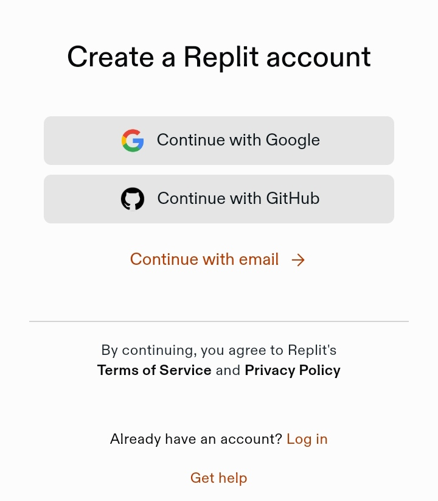
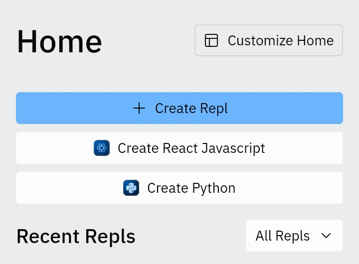
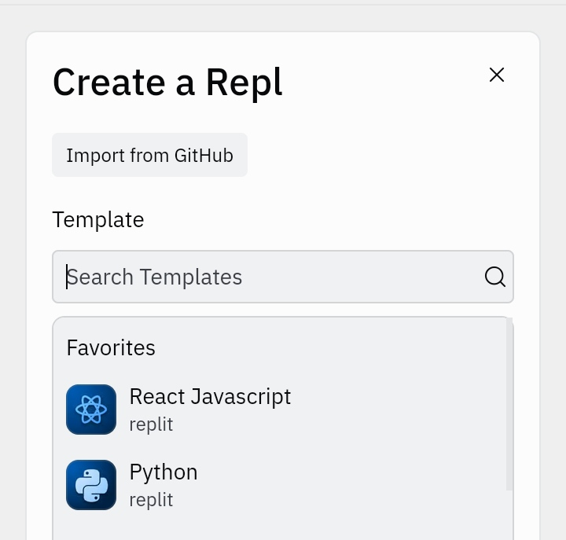
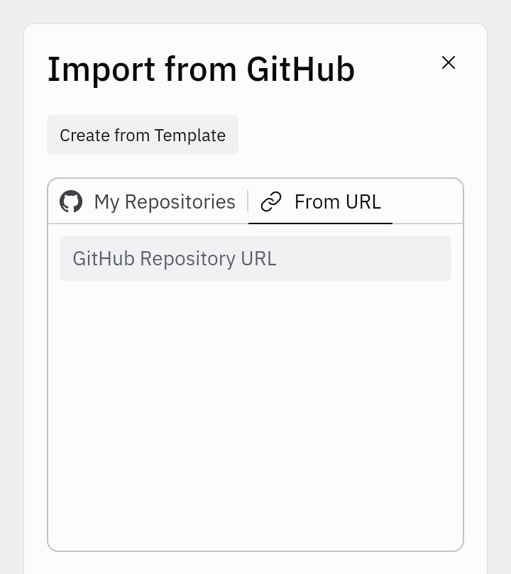
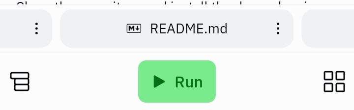
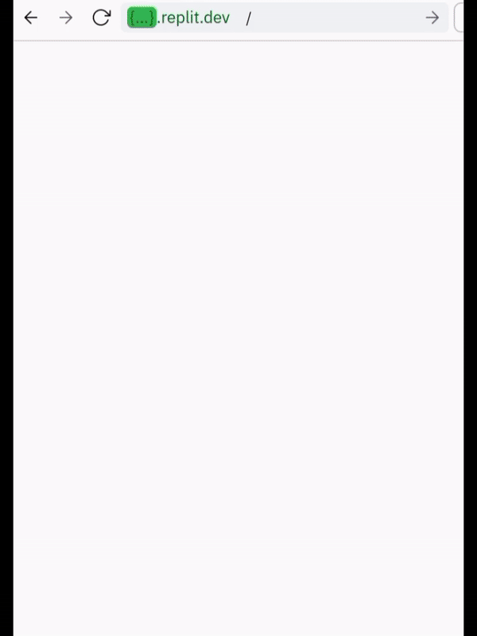

# React Tic Tac Toe with Socket.IO


Welcome to my React Society!

This project is a modern take on the classic game Tic Tac Toe, featuring a real gameplay experience with AI powered by Socket.IO and a sleek canvas-based UI.

## Getting Started

Replit is an online IDE that allows you to run and edit code from a browser. Here's how you can get this project up and running on Replit:

**Step 1: Create a Replit Account**



If you don't already have a Replit account, go to Replit.com and sign up for a free account.

**Step 2: Start a New Repl**



- Once logged in, click the **"+"** button or go to the **Repls** tab and click **"New Repl"**.



- Choose **"Import from GitHub"**.



- Paste the URL of this GitHub repository: `https://github.com/playscrbot/Tic-Tac-Toe`
- Click **"Import from GitHub"** again to create your Repl.

**Step 3: Wait for few secs and click Run Button**



- Once the import is complete, click on the **"Run"** button at the top of the page to start the application.

**Step 4: Playing the Game**



- After clicking **"Run"**, Replit will start the server and the React application should compile.
- A new window labeled **"Webview"** will appear showing your live game.
- Click on the **"Symbol"** next to replit dev url to play the game in full screen.

Enjoy the game!

**Support:**
If you encounter any issues or have questions about running the project, feel free to raise an issue in the GitHub repository or reach out to the community on Replit.


### Install dependencies
Clone the repository and install the dependencies:

```bash
git clone https://your-repository-url.git
cd your-repository-name
npm install react, socket.io, socket.io-client
```

Start the server
```bash
node backend/index.cjs
```

Run the React App
```bash
npm run dev
```


## Features
  - **Server connection**: Enhance your online gameplay to the next level using Socket.io.
  - **AI Opponent**: Sharpen your skills against a challenging AI.
  - **Stylish Canvas UI**: Enjoy a visually appealing game board.
  - **Learn React**: This is a basic yet perfect chance to start learning react game development.

# Backend Setup
The backend is built with Express and Socket.IO to handle real-time player login and logout.

```bash
// backend/index.cjs
const express = require('express');
const http = require('http');
const { Server } = require('socket.io');
const cors = require('cors');

// ...rest of the backend code
```

# Frontend Components
## App Component
The App component initializes the game and displays a loading spinner before rendering the TicTacToe component.

```bash
// App.jsx
import React, { useState } from 'react';
import { ClipLoader } from 'react-spinners';
import TicTacToe from './TicTacToe';

// ...rest of the App component
```

## Canvas Component
The Canvas component is responsible for drawing the game board and handling user interactions.

```bash
// Canvas.jsx
import React, { useRef, useEffect } from 'react';

// ...rest of the Canvas component
```

## TicTacToe Component
The TicTacToe component manages the game state and communicates with the backend server.

```bash
// TicTacToe.jsx
import React, { useState, useEffect, useCallback } from 'react';
import Canvas from './Canvas';

// ...rest of the TicTacToe component
```

## Config files
  - **vite.config.js**: Configures Vite for the React app.
  - **tsconfig.json**: Sets up TypeScript options for the project.

### Assets
Use Microsoft Copilot to create and upload your own assets to avoid copyright issues ©️

## Contributions
Contributions are welcome! Please feel free to submit a pull request or create an issue if you have any ideas or find any bugs.

## License
This project is open-sourced under the MIT license. See the LICENSE file for details.

### Made for Individuals who want to start learning JavaScript game development.

Have fun playing with AI 😁🌈
